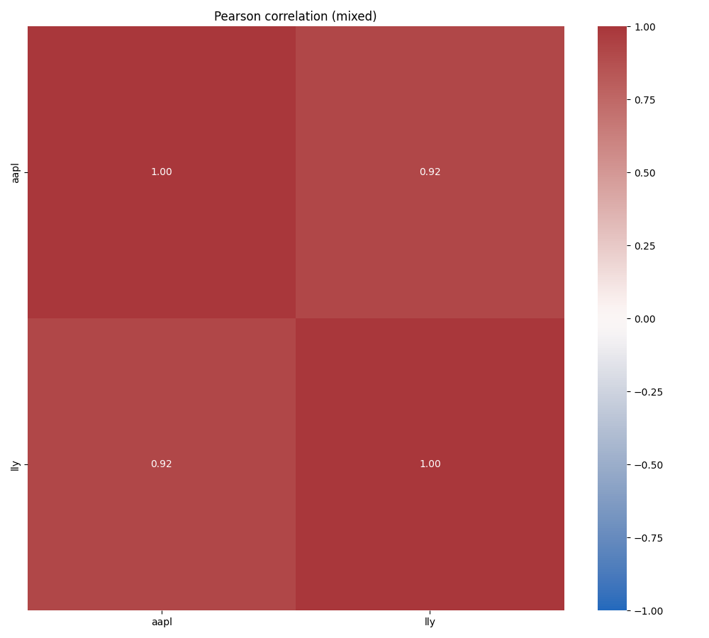
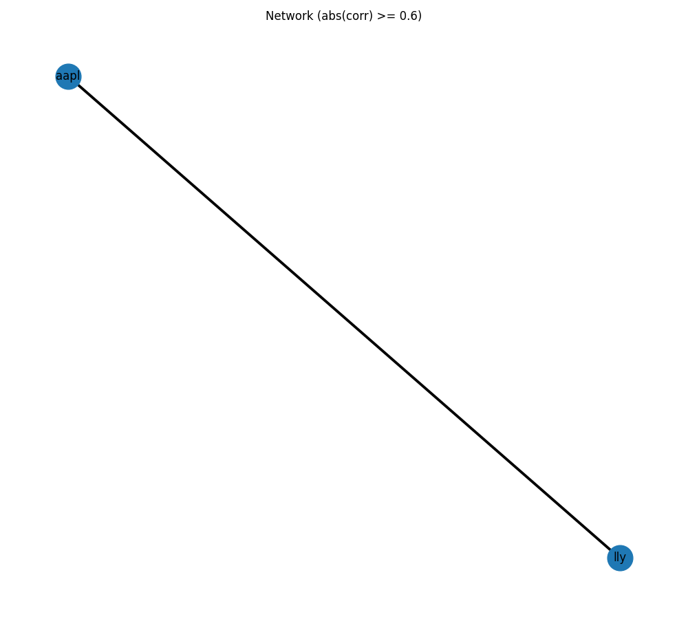
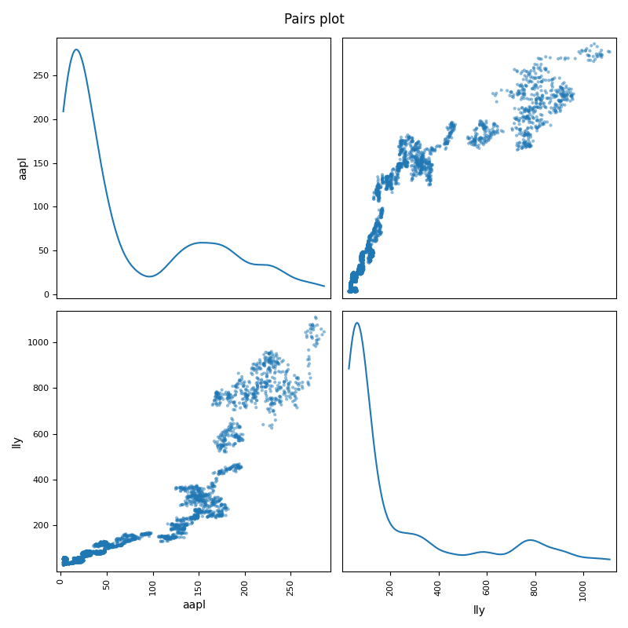

# Робота 3 — Кореляційний аналіз

Нижче наведено основні графіки, які створює скрипт `3_звіт.R` (збережені у `plots/report3/`).

**Графіки:**

> Примітка: назви останньої картинки (`scatter_TOP1_TOP2.png`) — це заповнювач; при запуску `3_звіт.R` файл для вибраної пари матиме назву `scatter_<ticker1>_<ticker2>.png`.

Результати (матриці кореляцій, список топ-пар та груп) збережено у `outputs/` (`corr_pearson.csv`, `top_correlated_partners.csv`, `ticker_groups_hclust.csv`, тощо).