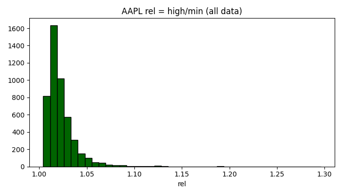
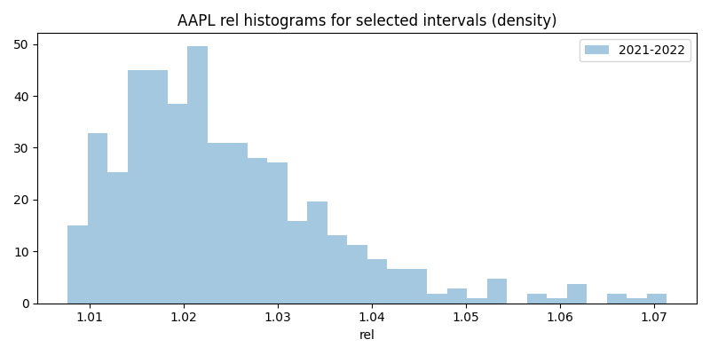
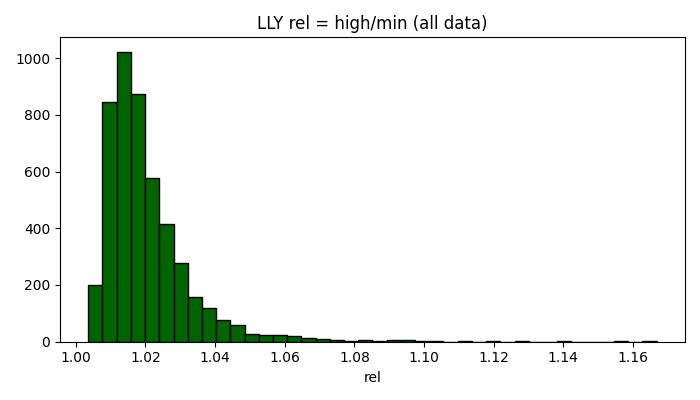
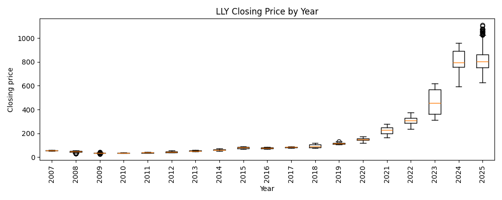
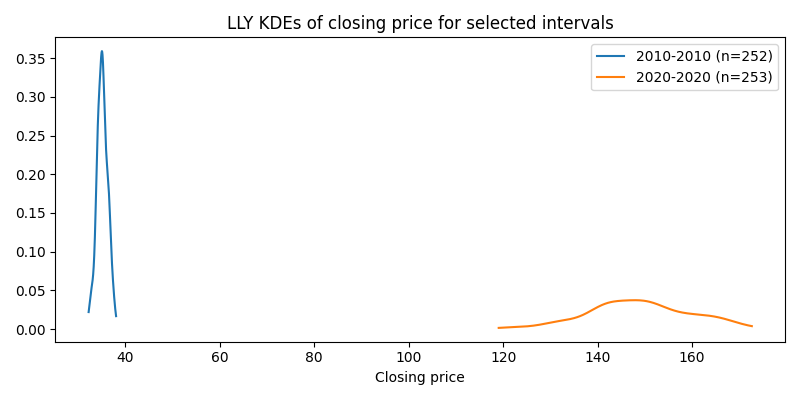

# Variant 1 Analysis

## AAPL 
- Data file: `data/table_ aapl .csv`
- Selected intervals (start-end):
  - 2007-2025 (4777 observations)

### Графіки (AAPL)

## LLY 
- Data file: `data/table_ lly .csv`
- Selected intervals (start-end):
  - 2007-2025 (4777 observations)

### Графіки (LLY)

